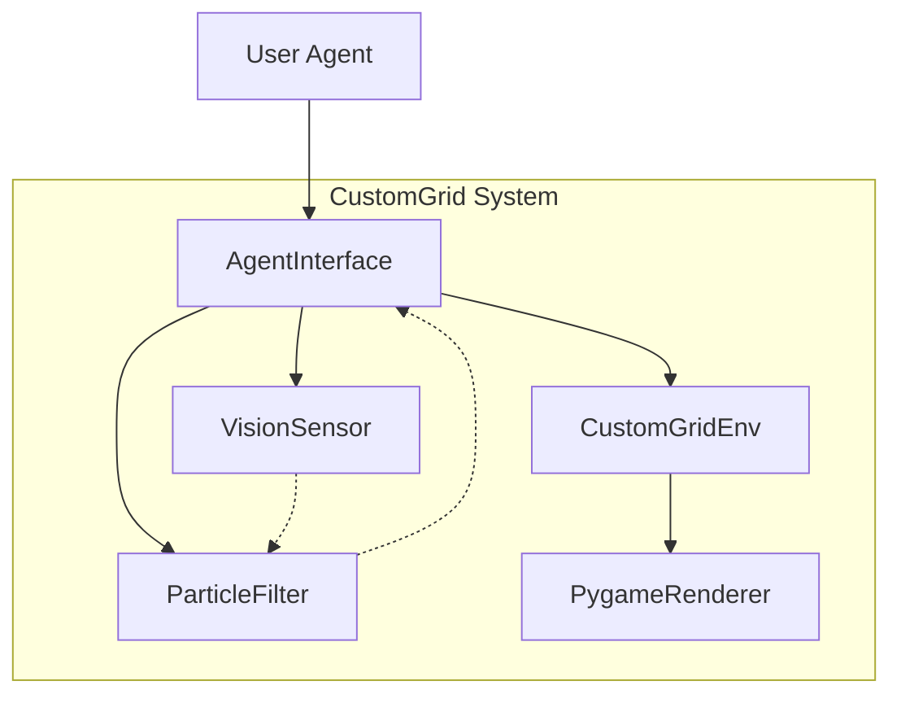
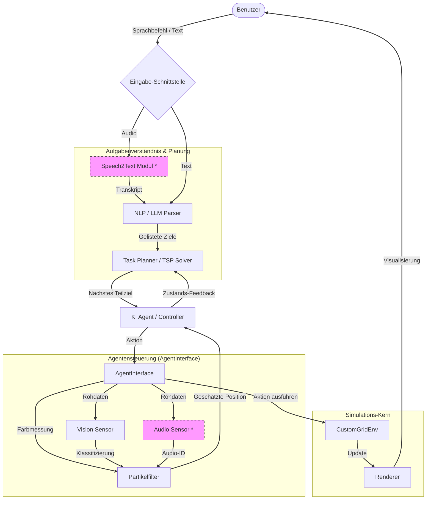
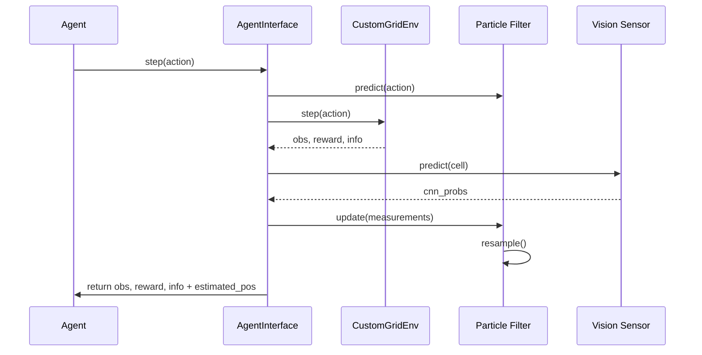
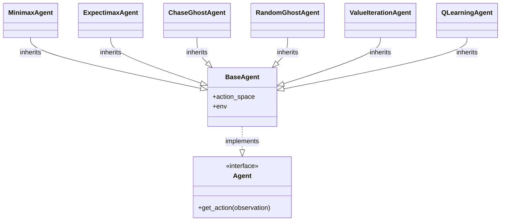

# Architektur

Dieses Dokument beschreibt die interne Architektur der CustomGrid-Umgebung und den vollständigen Workflow zur Aufgabenerfüllung.

## Systemübersicht

Die Umgebung ist modular aufgebaut, um eine einfache Erweiterung von Sensoren und Agenten zu ermöglichen.

## Vollständiger Workflow zur Aufgabenerfüllung

Das folgende Diagramm zeigt den kompletten Workflow, wie verschiedene Module zusammenarbeiten, um eine Benutzeraufgabe (z. B. per Sprache) in Aktionen des Agenten umzusetzen.

*\* Diese Module sind Teil des erweiterten Architektur-Konzepts für Studierende.*

## Datenfluss (Schritt-Ebene)

Der Datenfluss während eines einzelnen Simulationsschrittes (`step`):

## Klassen-Hierarchie

Die Agenten folgen einem Protokoll-basierten Design.

