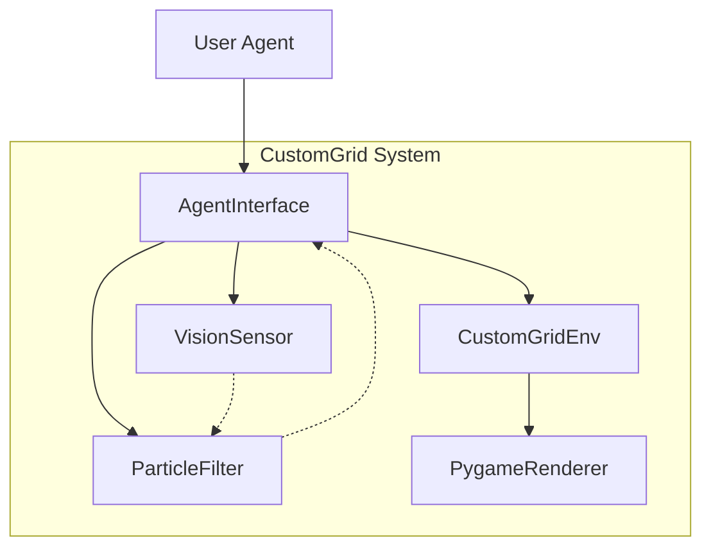
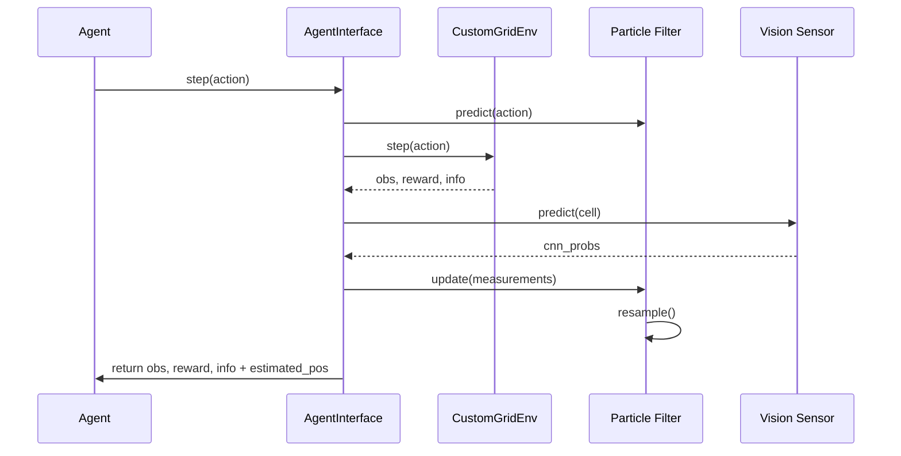
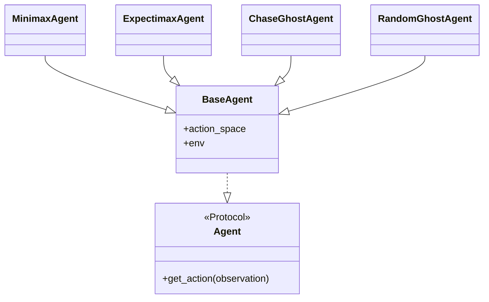

# Architektur

Dieses Dokument beschreibt die interne Architektur der CustomGrid-Umgebung.

## Systemübersicht

Die Umgebung ist modular aufgebaut, um eine einfache Erweiterung von Sensoren und Agenten zu ermöglichen.

## Datenfluss

Der Datenfluss während eines Schrittes (`step`) folgt einem strikten rundenbasierten Protokoll.

## Klassen-Hierarchie

Die Agenten folgen einem Protokoll-basierten Design.

