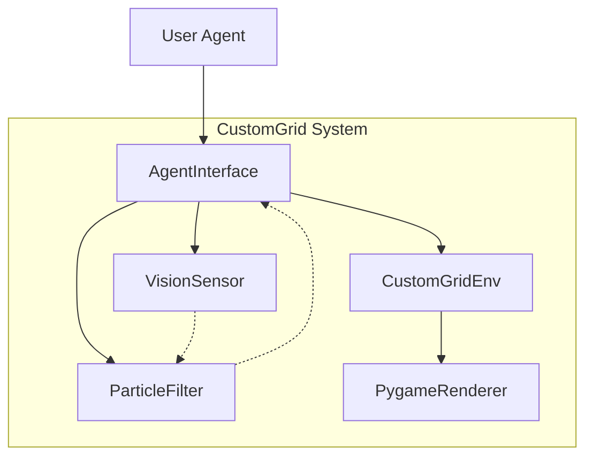
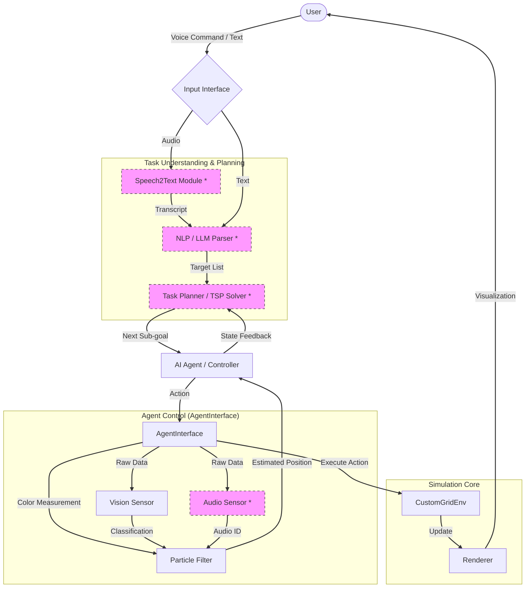
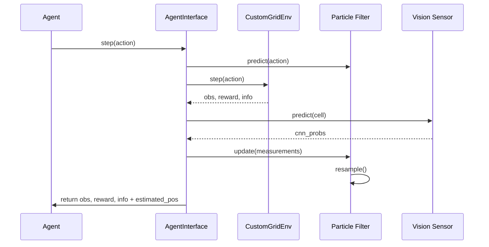
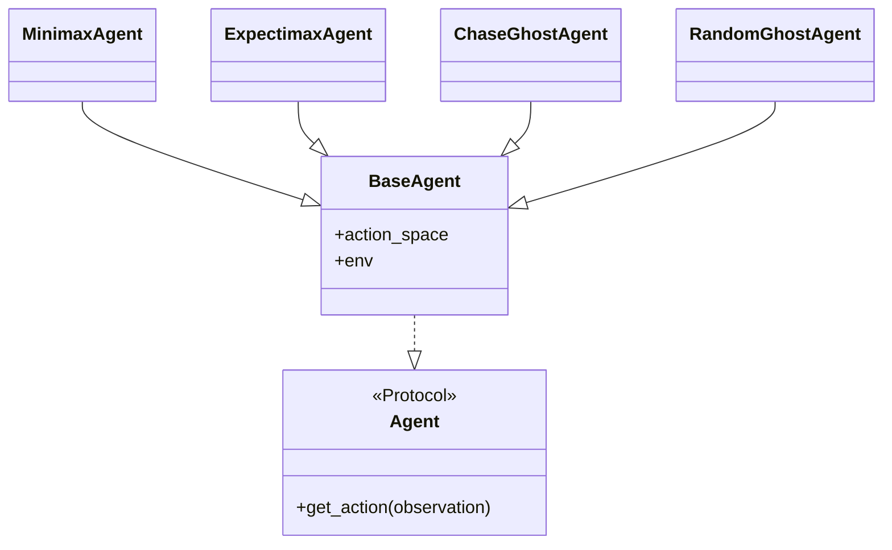

# Architecture

This document describes the internal architecture of the CustomGrid environment and the complete task fulfillment workflow.

## System Overview

The environment is designed modularly to allow easy expansion of sensors and agents.

## Complete Task Fulfillment Workflow

The following diagram shows the complete workflow of how various modules work together to translate a user task (e.g., via speech) into agent actions. This includes planned future modules like **Speech2Text** and the **Task Planner**.

*\* These modules are part of the extended architectural concept for students.*

## Data Flow (Step Level)

The data flow during a single simulation step (`step`):

## Class Hierarchy

The agents follow a protocol-based design.

