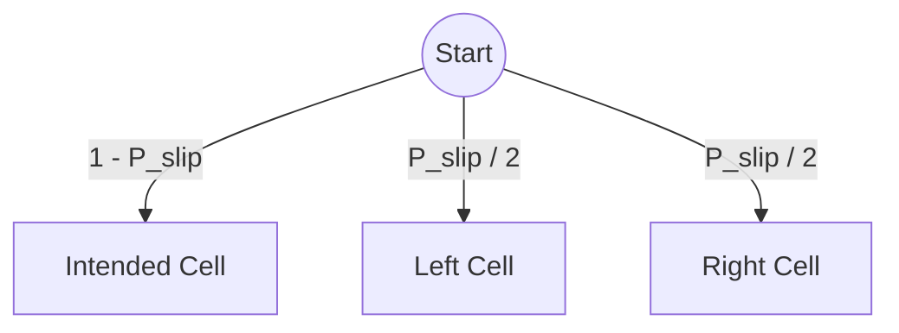
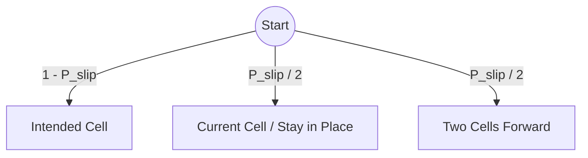

# Gameplay Mechanics

## Turn System

The game uses an **alternating turn system**:

1. **Agent's Turn**: The agent selects an action and executes it.  
2. **Ghost's Turn**: The ghost moves automatically according to its configured strategy.  

Each call to `interface.step(action)` processes both turns and returns the resulting state.

## Agent Behaviors

You can use different types of agents to navigate the grid:

- **RandomPlayerAgent**: Randomly selects one of the four possible actions in each turn.  
- **MinimaxAgent**: Uses the Minimax algorithm with Alpha-Beta pruning to find optimal moves while considering the ghost.  
- **ExpectimaxAgent**: Similar to Minimax, but accounts for the stochasticity of the environment (slipping).  

## Ghost Behaviors

The behavior of the ghost can be adjusted via the `AgentInterface` or the GUI. The following implementations are available:

- **ChaseGhostAgent (Default)**: The ghost calculates the shortest path to the agent (considering walls) and moves one step in that direction.  
- **RandomGhostAgent**: The ghost randomly selects one of the four possible actions in each turn.  
- **MinimaxAgent (as Ghost)**: The ghost can also use Minimax to actively corner the agent.  

## Actions

Both the agent and the ghost use the same action space:

| Action | Direction | Effect             |
|--------|-----------|--------------------|
| 0      | Left      | Column - 1 |
| 1      | Down      | Row + 1    |
| 2      | Right     | Column + 1 |
| 3      | Up        | Row - 1    |

## Grid Boundaries

The environment is **non-cycling**. This means there is no "wrap-around" effect; if an agent or ghost is at the edge of the grid and moves towards the boundary, it will remain in its current cell. The boundaries of the grid effectively act as permanent walls.

## Slip Probability

The environment includes a stochastic slip mechanic for the agent. With a configured probability $P_{\text{slip}}$, the agent moves differently than intended:

- **Perpendicular Slipping**: The agent moves in a perpendicular direction (equally distributed between the two perpendicular directions).  
- **Longitudinal Slipping**: The agent moves in the same direction but either stays in place or moves twice as far.  

### Visualizing Slip Probabilities

#### 1. Perpendicular Slipping
In this model, if a slip occurs, there is a risk that the agent deviates to the left or right (relative to the direction of movement).

#### 2. Longitudinal Slipping
In this model (default), if a slip occurs, the agent either stays in place or "slips" one cell further than planned.

